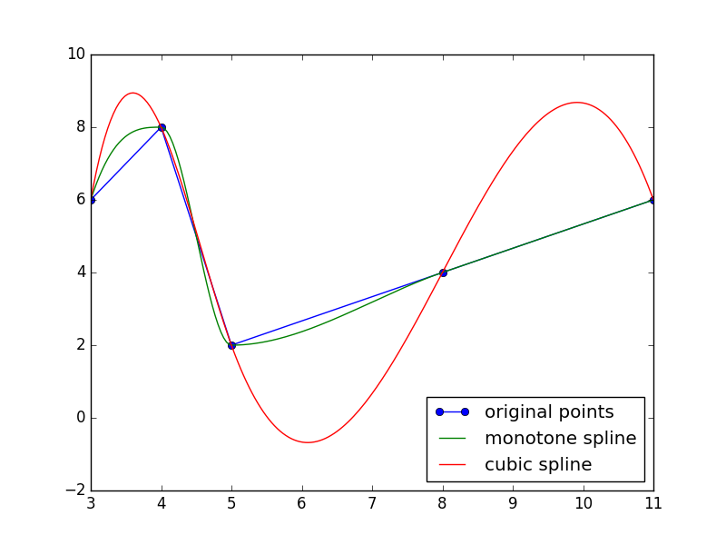

## Introduction

This is a python implementation of the monotone preserving cubic interpolation (Heyman J.M. Accurate monotonicity preserving cubic interpolation, SIAM, Journal on Scientific and Statistical Computing 4(4), 645-654). Comparing with the cubic spline, this method maintains the monotone and local extremes. It is strongly local, a small change in the input data only results in a small change in the interpolant contrary to natural cubic spline. The comparison between natrual cubic spline and monotone preserving cubic spline is shown below.

